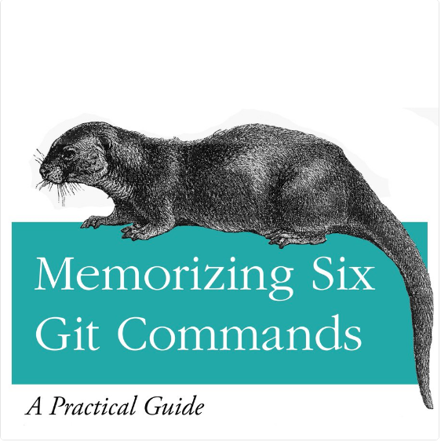

# GIT
---
For Derek:

---
## *Agenda*
+ What is Git?
+ How we use Git
+ Hands-on training
---
# *What is Git?*
---
Changes, not Code
---
Distributed
---
# *How we use Git*
---
GitFlow
---
+ Upstream
+ Origin
+ Local
---
Forks
---
https://github.com/OpenWhere/git-lesson
---
Clone
---
Create Local Repo:

```
$ git clone
https://github.com/<YOU>/git-lesson.git
```
---
Origin
---
Upstream
---
```
$ git remote add upstream
https://github.com/OpenWhere/git-lesson.git
```
---
One-way Data Flow
---
```
git fetch upstream
git checkout upstream/master
git branch my-feature
git checkout my-feature
```
---
*Branches*

+ Lightweight Pointers
+ Collections of Commits
---
*Commits*

+ Code Changes
+ Atomic
---
*Pull Requests*

+ One (or more!) Commits
+ Whole feature/bugfix
+ Great for Code Reviews
---
*Code Reviews*

+ Improve code quality
+ Hone skills
+ BEFORE merge (important for CI)
---
# *Hands-on Training*
---
So far:

+ Forking
+ Cloning
+ Branching
---
Now:

+ Committing
+ Submitting
+ Pull Requests
+ Merge Conflicts
---
*Edit:*
```
index.html
resources/generator.js
```
---
Committing
---
+ `git status`
+ `git diff`
+ `git add -p`
+ `git diff --cached`
+ `git commit`
---
Submitting
---
+ `git push origin my-feature`
+ [github.com/OpenWhere/git-lesson](github.com/OpenWhere/git-lesson)
+ Follow on-screen prompts to create Pull Request
---
Pull Requests
---
+ Review Code *again*
+ Write Descriptive Title
+ Add helpful description (screenshots!)
---
Code Reviews
---
Merge Conflicts
---
+ `git fetch upstream`
+ `git branch` (verify correct branch)
+ `git merge upstream/master`
+ Resolve conflicts
+ `git commit -a`
+ `git push origin my-feature`
---
# Questions?
---
# *Thanks!*
